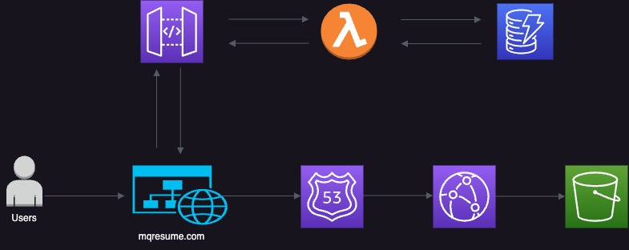

# Cloud Resume Challenge #
This repo will have updates of my code and experience of the cloud resume challenge.

## Description ##
The website is inspired by Forrest Brazeal's "AWS Cloud Resume Challenge", by using a combination of AWS services.
The website can he found here www.mqresume.com
## Architecture

### Services ###
* S3
* Dynamo DB
* Route 53
* CloudFront
* Gateway
* Lambda
* ACM
  

The website's HTML, JS, and CSS files are stored in an S3 bucket. The website is deployed using CloudFront for content distribution and is accessed securely via HTTPS. Route 53 and ACM are used to redirect traffic to the specified domain and manage SSL certificates. Additionally, a Lambda function is implemented to count visitors and save the count to a DynamoDB table, which is then displayed at the bottom of the webpage.
